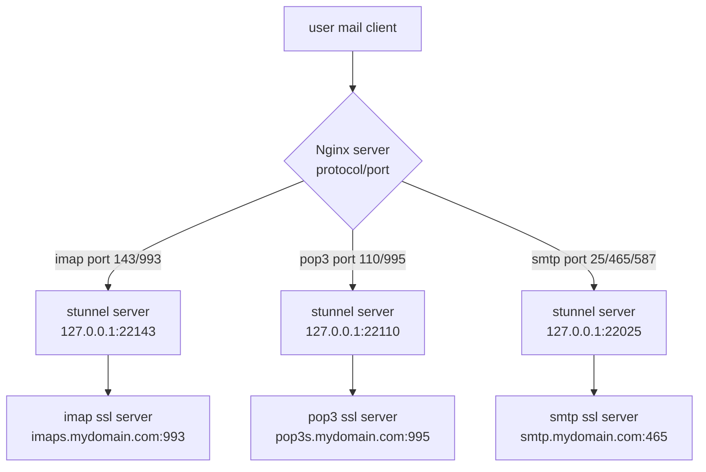

# nginx IMAP proxy
### nginx-compilation-and-configuration
### nginx SMTP proxy
### nginx POP proxy
### nginx mail proxy

Brief nginx compilation and configuration guide with fcgiwrap, mail imap/pop/smtp proxy module, etc.
nginx IMAP proxy https://pluslab.net/blog/nginx-imap-proxy/ 

Need to compile nginx because the default installation is not good enough? This guild could be helpful.

Connection diagram:
```
       /-----------------\
USER-->| NGINX server    |
       | protocol & port:|
       |-----------------|            
       |   smtp     25    \
       |            465    > 127.0.0.1:22025 --> stunnel-> SMTP ssl server (port 465)
       |            587   /
       |-----------------|            
       |   pop3     110   \
       |            995    > 127.0.0.1:22143 --> stunnel-> IMAP ssl server (port 993)
       |                  /
       |-----------------|            
       |   imap      143  \
       |             993   > 127.0.0.1:22110 --> stunnel-> POP3 ssl server (port 995)
       |                  /
       |-----------------|
       \-----------------/
```


OS:
- CentOS
- Ubuntu

Configuration:
- fcgiwrapper configuration (optional)
- nginx mail module (for imap, pop, and smtp proxy)

Auth methods (use any):
- Built in nginx authentication
- Perl CGI simple authentication (requires fcgiwrapper)
- Bash script with netcat simple example


Bonus:
- stunnel - making SSL connection to actual mail servers
- Dummy SSL installation
- Let's encrypt free SSL installation


Not (yet) included:
- php installation
